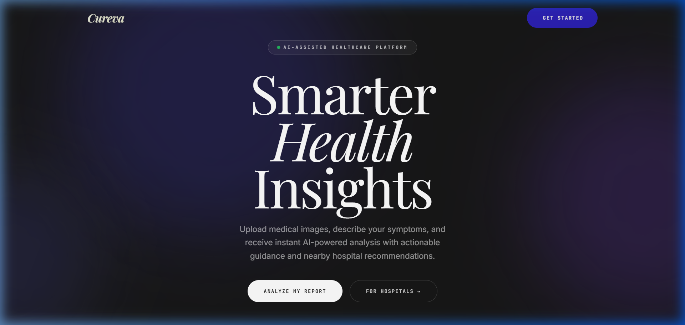
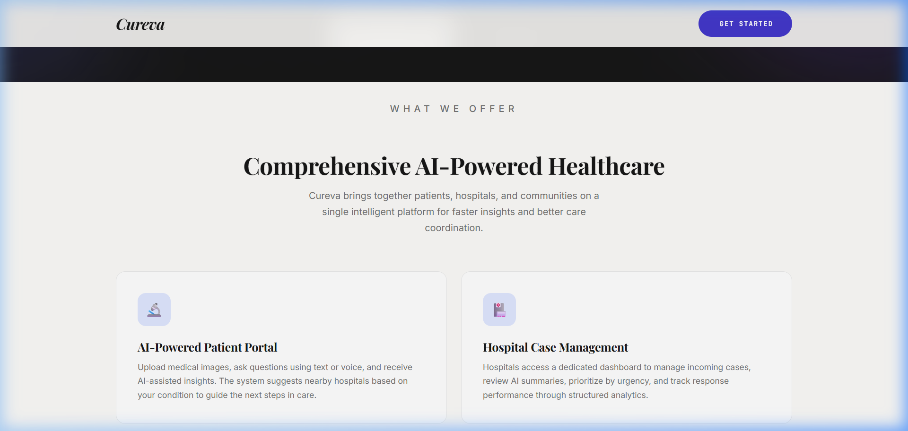
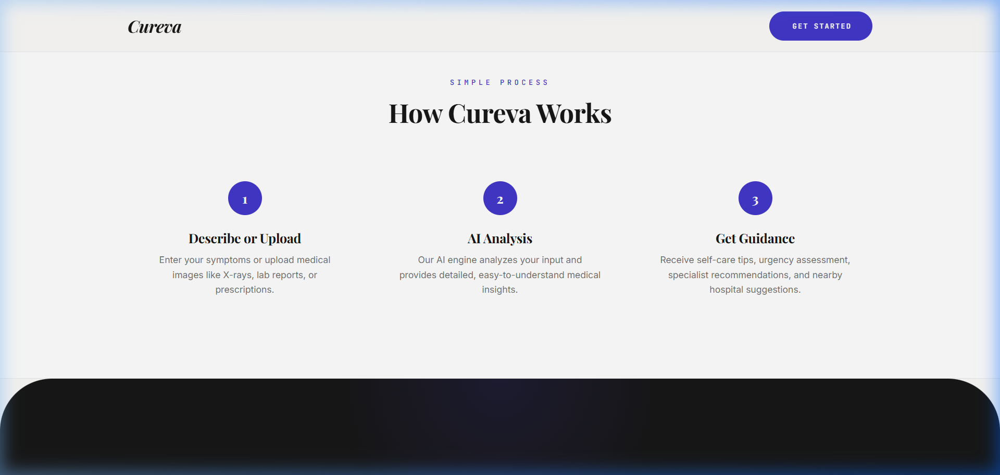

<p align="center">
  
  
  
  
  
</p>

<h1 align="center">🩺 Cureva — AI-Powered Patient & Hospital Assistance System</h1>

<p align="center">
  <strong>An intelligent healthcare triage platform that bridges the gap between patients and hospitals using AI-driven medical analysis, real-time case routing, and interactive hospital discovery.</strong>
</p>

<p align="center">
  <a href="https://cureva-ai-powered-patient-and-hospi-kappa.vercel.app/">🌐 Live Demo</a> •
  <a href="#-demo-credentials">🔑 Demo Login</a> •
  <a href="#-features">✨ Features</a> •
  <a href="#-tech-stack">🛠 Tech Stack</a> •
  <a href="#-getting-started">🚀 Setup</a>
</p>

---

> **⚠️ This is a Demo MVP** — The application uses pre-configured demo logins for demonstration purposes. All core features (AI analysis, hospital search, case management, messaging) are **fully functional**. Production authentication with full signup/login is implemented but the demo uses seeded accounts for easy testing.

---

## 📸 Screenshots

<p align="center">
  
</p>
<p align="center"><em>Landing Page — Organic Intelligence design with drifting mesh gradients</em></p>

<p align="center">
  
</p>
<p align="center"><em>Feature Overview — AI Patient Portal & Hospital Case Management</em></p>

<p align="center">
  
</p>
<p align="center"><em>Simple 3-Step Process — Describe, Analyze, Get Guidance</em></p>

---

## ✨ Features

### 🧑‍⚕️ Patient Portal
| Feature | Description |
|---------|-------------|
| **AI Medical Analysis** | Describe symptoms via text or upload medical images (X-rays, lab reports, prescriptions) for instant AI-powered analysis |
| **Conversational Chat** | Multi-turn chat with context-aware follow-up questions — the AI remembers your conversation history |
| **Urgency Assessment** | Every analysis includes a Low / Medium / High urgency rating with clear reasoning |
| **Self-Care Guidance** | Actionable self-care tips, OTC medication suggestions, and lifestyle recommendations |
| **Specialist Routing** | AI recommends the right medical department and specialties (Radiology, Cardiology, etc.) |
| **Hospital Discovery** | Interactive map powered by OpenStreetMap to find nearby hospitals based on your location |
| **Case Submission** | Send your AI analysis directly to a hospital for review with one click |
| **Chat History** | All conversations are saved and can be resumed or reviewed anytime |
| **Direct Messaging** | Real-time messaging between patients and hospital staff |

### 🏥 Hospital Dashboard
| Feature | Description |
|---------|-------------|
| **Case Management** | View, filter, and manage incoming patient cases with status tracking (Pending → In Review → Accepted → Resolved) |
| **AI Summary Review** | Read AI-generated summaries of patient symptoms and urgency assessments |
| **Priority Filtering** | Filter cases by urgency level, department, and status |
| **Case Notes** | Add clinical notes to cases and refer patients to other facilities |
| **Analytics Dashboard** | Track case volumes, response metrics, and department distribution |
| **Patient Messaging** | Communicate directly with patients through the built-in messaging system |

---

## 🛠 Tech Stack

### Backend
| Technology | Purpose |
|-----------|---------|
| **Python 3.10+** | Core backend language |
| **Flask 3.0** | Lightweight web framework with Jinja2 templating |
| **SQLAlchemy + Flask-SQLAlchemy** | ORM for database models and queries |
| **SQLite** (dev) / **PostgreSQL** (prod) | Database — auto-switches based on environment |
| **bcrypt** | Secure password hashing |

### AI & APIs
| Technology | Purpose |
|-----------|---------|
| **Google Gemini 2.5 Flash** | Medical image & symptom analysis with structured JSON output |
| **Overpass API (OpenStreetMap)** | Real-time hospital geolocation search — no API key needed |
| **Haversine Formula** | Accurate distance calculations between user and hospitals |

### Frontend
| Technology | Purpose |
|-----------|---------|
| **Vanilla HTML/CSS/JS** | Zero-dependency frontend — no build step required |
| **Leaflet.js** | Interactive hospital maps with markers and popups |
| **Playfair Display + Inter + JetBrains Mono** | Editorial-tech typography system |
| **CSS Custom Properties** | Design token system for consistent theming |

### Deployment
| Technology | Purpose |
|-----------|---------|
| **Vercel** | Serverless deployment with automatic GitHub integration |
| **WSGI** | Production-ready server configuration |

---

## 🏗 Architecture

```
cureva/
├── app.py                    # Flask application — all routes & API endpoints
├── wsgi.py                   # WSGI entry point for production
├── vercel.json               # Vercel deployment configuration
├── requirements.txt          # Python dependencies
├── .env.example              # Environment variable template
│
├── models/
│   └── database.py           # SQLAlchemy models (User, Conversation, Message, Case)
│
├── services/
│   ├── gemini_service.py     # Google Gemini AI integration with structured prompting
│   ├── maps_service.py       # Overpass API hospital search with specialty matching
│   └── image_parser.py       # Medical image preprocessing
│
├── static/
│   ├── css/
│   │   ├── base.css          # Design system tokens & global styles
│   │   ├── components.css    # Landing page component styles
│   │   ├── dashboard.css     # Patient dashboard styles
│   │   ├── hospital_dashboard.css  # Hospital dashboard styles
│   │   └── auth.css          # Login/signup styles
│   └── js/
│       ├── analyze.js        # AI chat interface & conversation management
│       └── maps.js           # Hospital map & case sending logic
│
├── templates/
│   ├── landing.html          # Public landing page
│   ├── login.html            # Authentication page
│   ├── patients/
│   │   ├── dashboard.html    # Patient home
│   │   ├── analyze.html      # AI analysis chat
│   │   ├── history.html      # Conversation history
│   │   ├── hospitals.html    # Hospital finder + map
│   │   ├── messages.html     # Patient messaging
│   │   └── profile.html      # Patient profile
│   └── hospitals/
│       ├── dashboard.html    # Hospital case management
│       ├── messages.html     # Hospital messaging
│       ├── analytics.html    # Performance analytics
│       ├── settings.html     # Hospital settings
│       └── profile.html      # Hospital profile
│
└── api/
    └── index.py              # Vercel serverless function entry
```

---

## 🔑 Demo Credentials

Since this is a **demo MVP**, use these pre-configured accounts to explore:

| Role | Email | Password |
|------|-------|----------|
| 🧑‍⚕️ **Patient** | `Patient_demo@gmail.com` | `demo_password` |
| 🏥 **Hospital** | `Demo_Hospital@gmail.com` | `hospital_demo` |

> **Note:** You can also create new accounts via the Sign Up page — full authentication with bcrypt password hashing is implemented.

---

## 🚀 Getting Started

### Prerequisites
- Python 3.10 or higher
- A [Google Gemini API key](https://ai.google.dev/) (free tier available)

### 1. Clone the Repository
```bash
git clone https://github.com/Lalit-7/Cureva-AI-Powered-Patient-and-Hospital-Assistance-System.git
cd Cureva-AI-Powered-Patient-and-Hospital-Assistance-System
```

### 2. Set Up Virtual Environment
```bash
python -m venv .venv

# Windows
.venv\Scripts\activate

# macOS/Linux
source .venv/bin/activate
```

### 3. Install Dependencies
```bash
pip install -r requirements.txt
```

### 4. Configure Environment Variables
```bash
cp .env.example .env
```
Edit `.env` and add your Gemini API key:
```env
GEMINI_API_KEY=your_google_gemini_api_key_here
SECRET_KEY=generate_a_random_secret_key
```

### 5. Run the Application
```bash
python app.py
```
Open your browser and navigate to **http://127.0.0.1:5000**

---

## 🔑 API Endpoints

<details>
<summary><strong>Click to expand full API reference</strong></summary>

### Authentication
| Method | Endpoint | Description |
|--------|----------|-------------|
| POST | `/api/auth/login` | Login with email, password, role |
| POST | `/api/auth/signup` | Register a new account |
| GET | `/api/auth/me` | Get current user info |
| POST | `/logout` | Clear session and logout |

### AI Analysis
| Method | Endpoint | Description |
|--------|----------|-------------|
| POST | `/api/analyze` | Submit text/image for AI medical analysis |

### Conversations
| Method | Endpoint | Description |
|--------|----------|-------------|
| POST | `/api/conversation/new` | Create a new chat conversation |
| GET | `/api/conversations` | List all user conversations |
| GET | `/api/conversation/<id>` | Get conversation with messages |
| PUT | `/api/conversation/<id>/title` | Update conversation title |
| DELETE | `/api/conversation/<id>` | Delete a conversation |

### Hospital Search
| Method | Endpoint | Description |
|--------|----------|-------------|
| POST | `/api/nearby-hospitals` | Find hospitals by lat/lng |
| POST | `/api/hospital-map-data` | Get map-formatted hospital data |

### Case Management
| Method | Endpoint | Description |
|--------|----------|-------------|
| POST | `/api/cases/send` | Patient sends case to a hospital |
| GET | `/api/cases` | Get cases (filtered by role) |
| GET | `/api/cases/stats` | Dashboard statistics |
| PUT | `/api/cases/<id>/status` | Update case status |
| PUT | `/api/cases/<id>/notes` | Add hospital notes |

### Messaging
| Method | Endpoint | Description |
|--------|----------|-------------|
| GET | `/api/messages/conversations` | List message threads |
| POST | `/api/messages/send` | Send a message |
| GET | `/api/messages/conversation/<id>` | Get message thread |

</details>

---

## 🎨 Design System — "Organic Intelligence"

The UI follows a custom **editorial-tech hybrid** design language:

- **Palette:** Warm cream `#fcfbf9` · Rich charcoal `#171717` · Indigo accent `#4338ca`
- **Typography:** Playfair Display (headings) · Inter (body) · JetBrains Mono (UI labels)
- **Motion:** Signature `cubic-bezier(0.22, 1, 0.36, 1)` easing on all interactions
- **Effects:** Drifting mesh gradient backgrounds, hover pop animations, glassmorphism cards

---

## 🌐 Deployment

The app is deployed on **Vercel** with automatic GitHub integration:

1. Push changes to `main` branch
2. Vercel automatically builds and deploys
3. Environment variables are configured in Vercel Dashboard → Settings → Environment Variables

**Required Vercel Environment Variables:**
| Variable | Description |
|----------|-------------|
| `GEMINI_API_KEY` | Google Gemini API key |
| `SECRET_KEY` | Flask session secret |
| `DATABASE_URL` | PostgreSQL connection string (optional — uses SQLite if not set) |

---

## 📄 License

This project is open source and available under the [MIT License](LICENSE).

---

<p align="center">
  Built with ❤️ by <a href="https://github.com/Lalit-7">Lalit</a>
</p>
